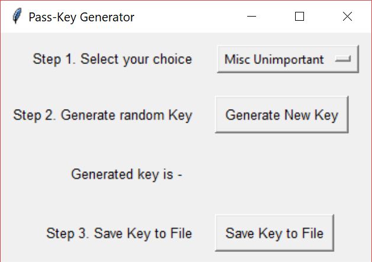

# Passphrase-Generator

Small python script that is used for generating a 1+5 digit numeric key that the user can use to decode their main password.
It makes use of the in-built Tkinter library in python to render the GUI. The GUI rendered on Windows 10 is shown below.

The passkeys are saved in a text file in the working directory. Since the key itself cannot be used as a password any unautorized access to this file will not reveal the real password
This file needs to be in the same working directory to allow the program to write new keys as well as ensure that the generated key is not already in the file.

__Planned enhancements__
- [ ] Adding a text entry field to link the passkey to the account for which it was generated
- [ ] Changing the passkey of a certain entry
